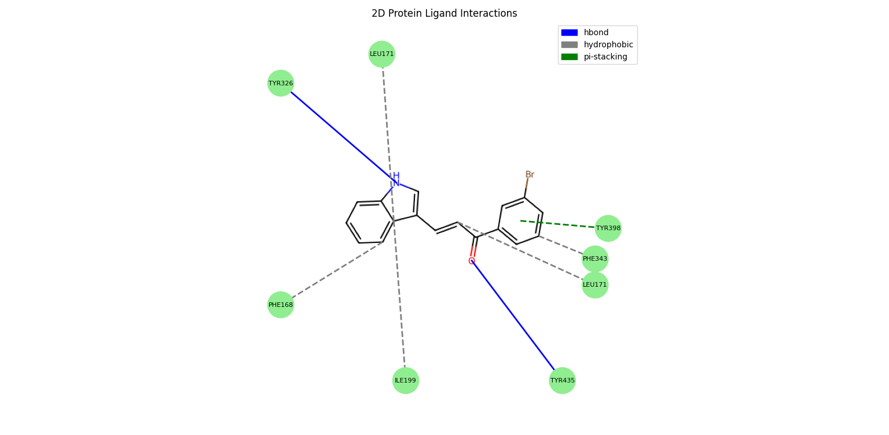

# 2DIFY

<b>Generate 2D Protein-Ligand Interaction with PLIP output (report.txt and complex.pdb given to PLIP as input)</b>

# Interactions Reported
<li><b>H-Bond</b> - Solid Grey</li>
<li><b>Hydrophobic Interactions</b> - Dashed Grey</li>
<li><b>Pi-Pi Stacking</b> - Dashed Green</li>
<li><b>Halogen Bond</b> - Solid Cyan</li>
<li><b>Pi-Cation</b> - Dashed Orange</li>
<li><b>Salt Bridges</b> -  Dotted Yellow</li>

# Instructions to NOTE:

<li> You can now , pip install 2DIFY==1.0.1</li>
<li> At First, Use PLIP to generate report.txt <b>CLI command: plip -f complex.pdb -pty</b> </li>
<li> <b>Use 2Dify_cli.py to pass arguements for resname, pdb complex, report file generated from PLIP, template file of ligand inside protein for bond orders takes .sdf, .mol and even SMILES and at last specifcy output directory . Example use case: python 2dify_cli.py --resname HEY --pdb .\example\complex.pdb --report .\example\report.txt --template .\example\I2.sdf --out ".". For python function, use twodimensional_plot.py for python function </b>  </li>
<li> Make venv with requirements.txt , and run the above command at the directory after cloning the repository</li>
<li>Please note that sometimes interactions might interchange due lig_idx being misplaced in report.txt</li>

# How it Works:

 It works by taking the lig_idx mentoned in the report.txt which matches with PDB atom serial number . Now this is mapped with RDKit mol object (atom_idx) got with the extraction of PDB file. The Interactions are plotted accordingly with corresponding Amino acid labels which are mapped with the lig_idx in the first place. Amino acid labels are not represntative of their 3D coordinates 

# Limitations

<li> Lig_idx can be misplaced in report.txt. Always Cross Verify</li>

 Please contribute to make it more better

# Dependency
Rdkit, Matplotlib, Numpy, and PIL

# Cite Us

 Muzammil Kabier 2DIFY: https://github.com/Muzatheking12/2DIFY 

